# ☁️ Cloud Computing Internship – Task 2

## Host a Static Website Using Cloud Storage

This project was completed as part of the **Cloud Computing Internship at Veda Technology**.

The objective of this task was to deploy a simple static website using **Amazon S3 Static Website Hosting** instead of using a traditional virtual machine.

---

## 🎯 Objective

To host a static HTML/CSS website using Amazon S3 and configure:

- Static website hosting
- Index document
- Custom error document
- Public read access
- Scoped bucket policy
- Website accessibility through an S3 website endpoint

---

## 🛠️ Technologies Used

- **Amazon S3**
- **HTML5**
- **CSS3**
- **S3 Bucket Policy**
- **GitHub**
- **Amazon S3 Static Website Hosting**

---

## 📁 Project Structure

```text
veda-task2-s3-static-website/
│
├── 404.html
├── index.html
├── style.css
├── README.md
│
├── 01-local-website.png
├── 02-github-repository-created.png
├── 03-s3-bucket-configuration.png
├── 04-s3-bucket-created.png
├── 05-s3-uploaded-files.png
├── 06-static-website-hosting-configuration.png
├── 07-s3-website-endpoint.png
├── 08-block-public-access-disabled.png
├── 09-bucket-policy.png
├── 10-bucket-policy-saved.png
├── 11-live-website.png
└── 12-error-page.png
```

## ☁️ AWS S3 Configuration
| Configuration  | Details                                |
| -------------- | -------------------------------------- |
| Cloud Service  | Amazon S3                              |
| Bucket Name    | `veda-task2-pooja-static-website-2026` |
| AWS Region     | `ap-south-1` (Mumbai)                  |
| Website Type   | Static Website                         |
| Index Document | `index.html`                           |
| Error Document | `404.html`                             |
| Content Type   | HTML / CSS                             |

     
## 🏗️ Architecture

The static website follows this simple deployment flow:

**Visitor**  
↓  
**S3 Website Endpoint**  
↓  
**Amazon S3 Bucket**  
↓  
**Website Files**

- `index.html` – Main website page
- `style.css` – Website styling
- `404.html` – Custom error page

### Deployment Flow

```text
Visitor
   |
   v
S3 Website Endpoint
   |
   v
Amazon S3 Bucket
   |
   +---- index.html
   |
   +---- style.css
   |
   +---- 404.html


 ```
                   
## 🚀 Deployment Steps
1. Create an S3 Bucket

Created the following S3 bucket in the Mumbai region:
veda-task2-pooja-static-website-2026

2. Upload Website Files

The following website files were uploaded to the S3 bucket:

index.html
style.css
404.html

3. Enable Static Website Hosting

Static website hosting was enabled with:

Index document: index.html
Error document: 404.html

4. Configure Public Access

Block Public Access was disabled for this website bucket so that the static website could be accessed publicly.

Public access was limited to the required bucket and was not applied to the entire AWS account.

5. Configure Bucket Policy

A bucket policy was configured to allow public read access to objects using:

s3:GetObject

The policy is restricted to objects inside this specific bucket.

No public permissions were granted for:

Uploading objects
Deleting objects
Listing bucket contents

6. Test the Website

The deployed website was successfully accessed through the Amazon S3 website endpoint.

7. Test the Error Page

A nonexistent URL was requested to verify that the configured 404.html page works correctly.


## 🌐 Live Website
Amazon S3 Website Endpoint
http://veda-task2-pooja-static-website-2026.s3-website.ap-south-1.amazonaws.com

Note: The direct Amazon S3 website endpoint uses HTTP. For a production deployment requiring HTTPS, Amazon CloudFront can be used in front of the S3 origin.


## 🔐 Security Configuration

The bucket policy follows the principle of limited public access.

Public users are allowed only:

s3:GetObject

The policy does not provide public permissions for:

Uploading objects
Deleting objects
Modifying objects
Listing bucket contents

The public access configuration is applied only to the website bucket and does not expose the entire AWS account.


## 💰 Cloud Storage vs Virtual Machine
Amazon S3

Amazon S3 is suitable for static websites because it stores and serves static files without requiring a continuously running web server.

Typical S3 usage includes:

Object storage
Requests
Data transfer
Virtual Machine

A virtual machine such as Amazon EC2 requires compute resources and may also require:

Compute instance
Block storage
Operating system management
Web server configuration
Security configuration
Maintenance and updates

For a simple static website, object storage avoids the need to maintain a continuously running web server.

Actual costs depend on usage, AWS region, account status, and applicable AWS pricing or free-tier offers.


## 🧪 Testing Performed
Test 1 – Website Access

The main website was opened using the S3 website endpoint.

Result: Successful.

Test 2 – 404 Error Handling

A nonexistent path was opened:

/does-not-exist

Result: Custom 404.html page was displayed successfully.


## 🔄 Rollback Evidence

The project is maintained using GitHub version history.

Changes to the website can be tracked through Git commits, allowing a previous version of the website files to be restored when required.

A controlled website change and rollback will be demonstrated using GitHub commit history as part of the project evidence.


## 📸 Screenshots

The following screenshots provide visual evidence of the complete deployment process.

### 1. Local Website

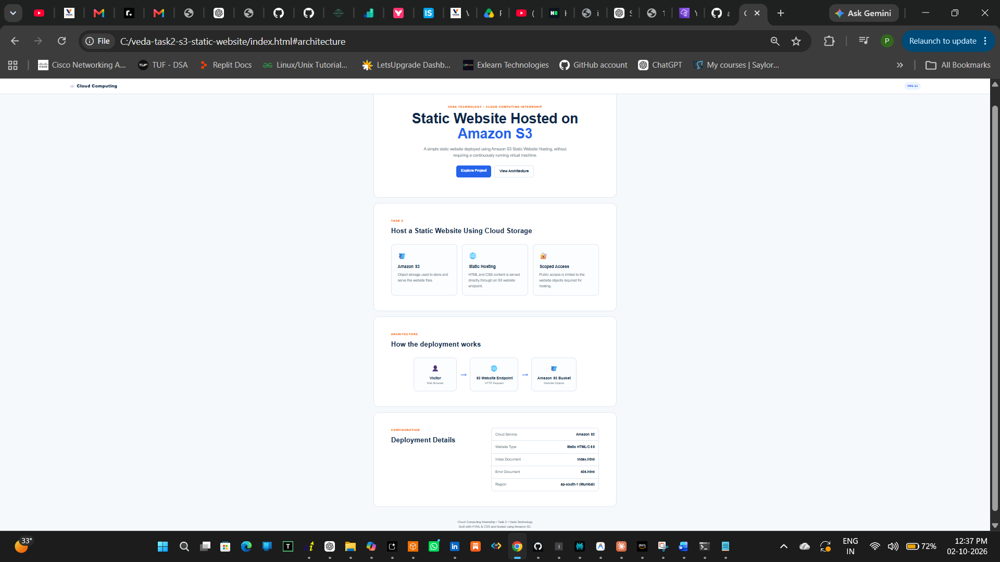

The static website was first tested locally before deployment.

---

### 2. GitHub Repository

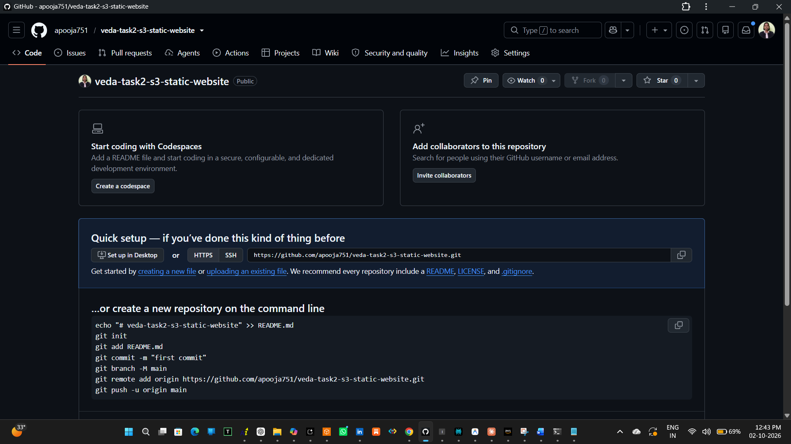

GitHub repository created for the internship task.

---

### 3. S3 Bucket Configuration

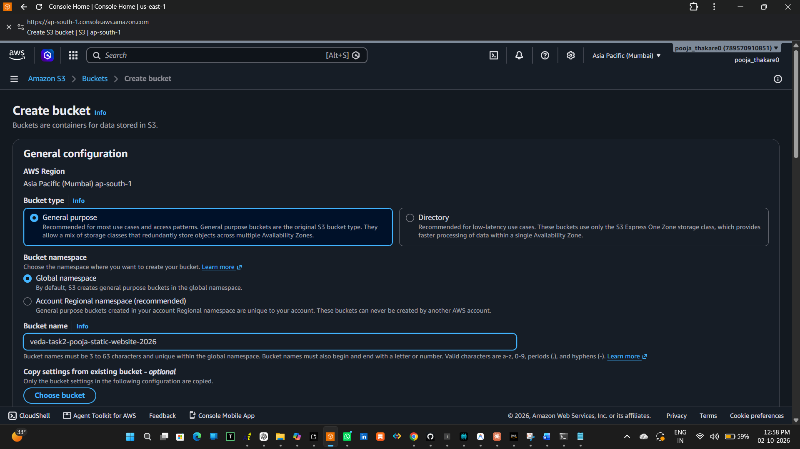

Amazon S3 bucket configured in the Mumbai (`ap-south-1`) region.

---

### 4. S3 Bucket Created

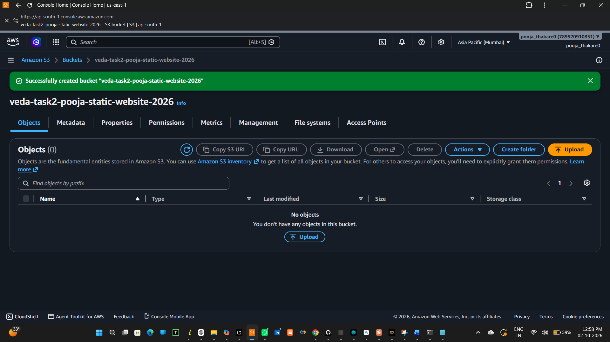

The S3 bucket was successfully created.

---

### 5. Website Files Uploaded to S3

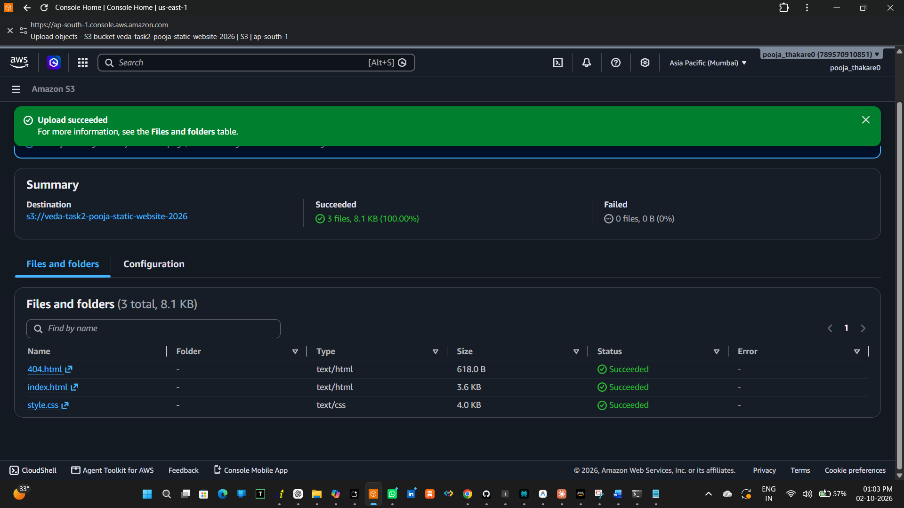

The `index.html`, `style.css`, and `404.html` files were successfully uploaded.

---

### 6. Static Website Hosting Configuration

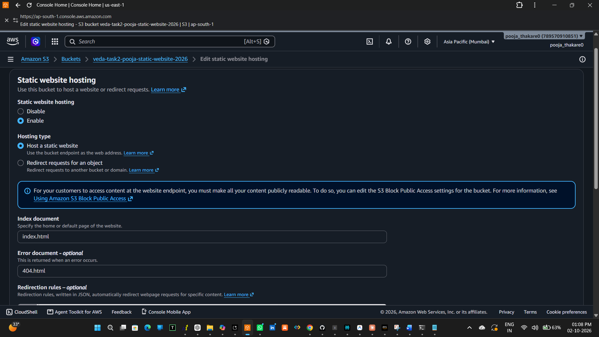

Static website hosting configured with `index.html` as the index document and `404.html` as the error document.

---

### 7. S3 Website Endpoint

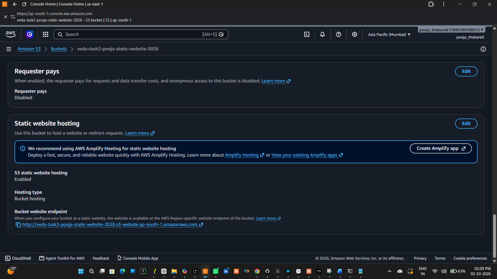

Amazon S3 generated the website endpoint for accessing the deployed website.

---

### 8. Block Public Access Configuration

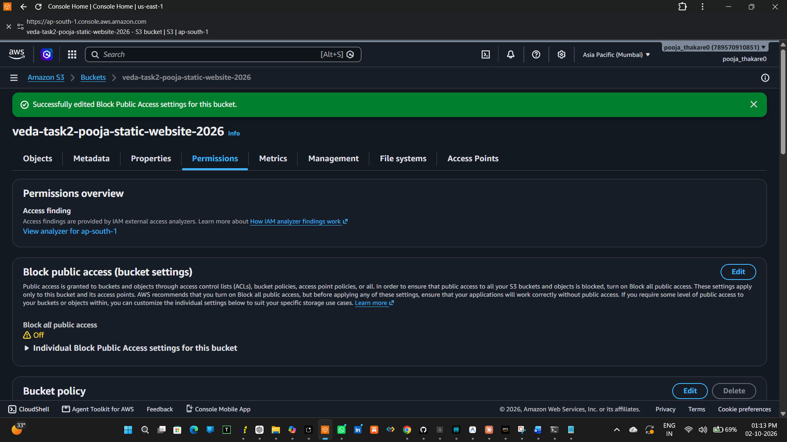

Block Public Access was disabled for the website bucket to allow public access through the configured bucket policy.

---

### 9. Bucket Policy

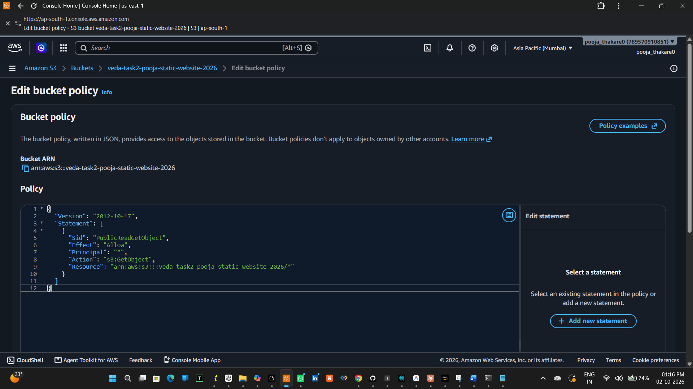

Bucket policy configured to allow public `s3:GetObject` access to objects in the specific website bucket.

---

### 10. Bucket Policy Successfully Saved

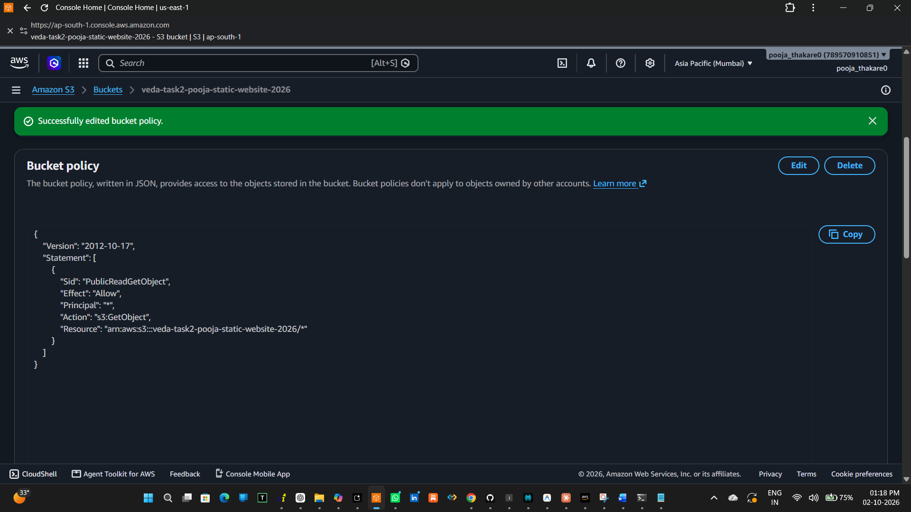

The bucket policy was successfully saved.

---

### 11. Live Website

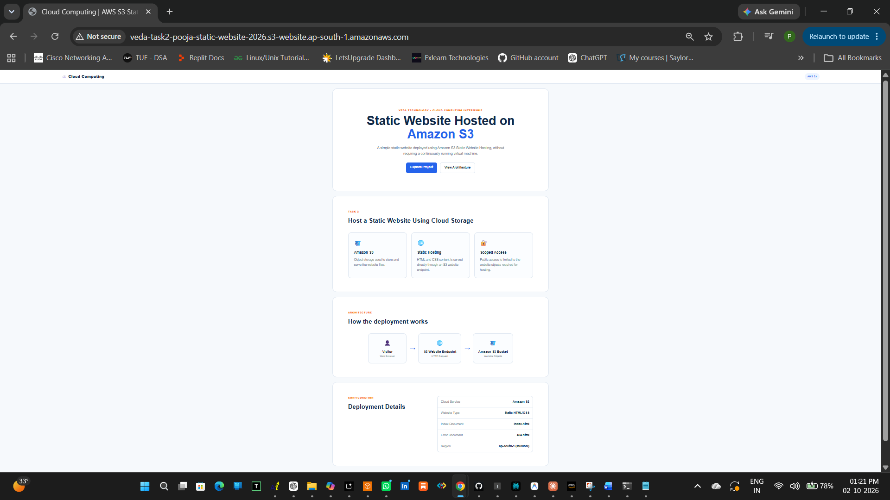

The static website was successfully accessed through the Amazon S3 website endpoint.

---

### 12. Custom 404 Error Page

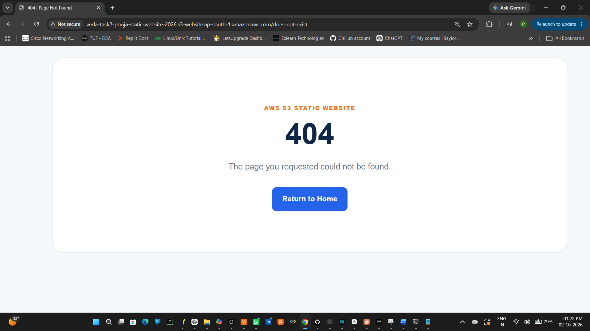

The custom `404.html` page was successfully displayed when a nonexistent URL was requested.


## 🎓 Key Learning Outcomes

Through this task, I learned:

How Amazon S3 stores objects
How to create and configure an S3 bucket
How to host a static website using Amazon S3
How to configure index and error documents
How S3 bucket policies control access
How to provide scoped public read access
How to deploy and test a static website
The difference between object storage and virtual machines
The importance of limiting public cloud permissions

## 👩‍💻 Internship Details

Cloud Computing Internship – Veda Technology

Task 2: Host a Static Website Using Cloud Storage

## 📌 Conclusion

The static website was successfully deployed using Amazon S3 Static Website Hosting. The website is publicly accessible through the S3 website endpoint, and a custom 404 error page was configured and tested successfully.

This project demonstrates practical knowledge of cloud storage, static website hosting, access control, AWS S3 configuration, and basic cloud deployment concepts.
